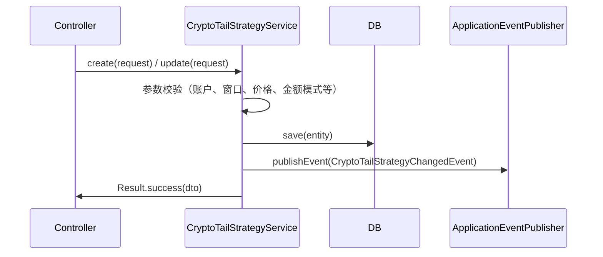
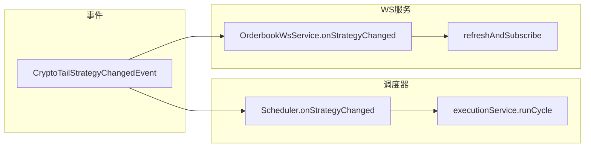
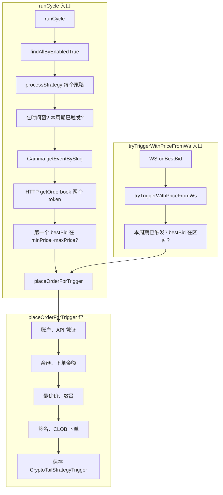

# 加密市场尾盘策略 - 流程图

## 一、整体架构

```
┌─────────────────┐     POST 创建/更新      ┌──────────────────────────┐
│   前端 / API    │ ──────────────────────►│ CryptoTailStrategyController│
└─────────────────┘                        └──────────────┬─────────────┘
                                                          │
                                                          ▼
                                               ┌──────────────────────────┐
                                               │ CryptoTailStrategyService │
                                               │  create / update          │
                                               │  save → publishEvent      │
                                               └──────────────┬─────────────┘
                                                              │
                    ┌─────────────────────────────────────────┼─────────────────────────────────────────┐
                    │ CryptoTailStrategyChangedEvent           │                                         │
                    ▼                                         ▼                                         ▼
     ┌──────────────────────────────┐         ┌──────────────────────────────┐         ┌──────────────────────────────┐
     │ CryptoTailStrategyScheduler  │         │ CryptoTailOrderbookWsService │         │ (其他监听方，如有)           │
     │ @EventListener               │         │ @EventListener               │         └──────────────────────────────┘
     │ → runCycle() 一次（补充）      │         │ → refreshAndSubscribe()      │
     └──────────────┬───────────────┘         └──────────────┬───────────────┘
                    │                                         │
                    ▼                                         │
     ┌──────────────────────────────┐                         │
     │ CryptoTailStrategyExecution  │                         │ 每 25 秒 + 事件时
     │ runCycle()                    │                         │ refreshAndSubscribe()
     │ (HTTP 拉订单簿，满足则下单)    │                         ▼
     └──────────────────────────────┘              ┌──────────────────────────────┐
                                                     │  CLOB Market WebSocket       │
                                                     │  wss://.../ws/market         │
                                                     │  subscribe assets_ids       │
                                                     └──────────────┬───────────────┘
                                                                    │ book / price_change
                                                                    ▼
                                                     ┌──────────────────────────────┐
                                                     │ onBestBid(tokenId, bestBid)   │
                                                     │ → tryTriggerWithPriceFromWs  │
                                                     └──────────────┬───────────────┘
                                                                    │
                                                                    ▼
                                                     ┌──────────────────────────────┐
                                                     │ CryptoTailStrategyExecution  │
                                                     │ placeOrderForTrigger         │
                                                     │ → CLOB 下单 + 写触发记录      │
                                                     └──────────────────────────────┘
```

---

## 二、策略创建/更新流程（API → 事件）



- **创建**：校验通过后落库，发布 `CryptoTailStrategyChangedEvent`，返回 DTO。
- **更新**：同上，更新实体后发布同一事件。
- **删除**：不发布事件（策略已移除，WS 下次刷新订阅时会自然不再包含该策略）。

---

## 三、策略变更后：双路响应

事件发出后，两个监听方并行执行，互不阻塞：

| 监听方 | 动作 | 说明 |
|--------|------|------|
| **CryptoTailStrategyScheduler** | `onStrategyChanged` → `runCycle()` 一次 | 用 HTTP 拉订单簿做一轮检查，作为 WS 未就绪时的补充。 |
| **CryptoTailOrderbookWsService** | `onStrategyChanged` → `refreshAndSubscribe()` | 按当前启用策略重新算 token 列表，向 WS 发送新的 `assets_ids` 订阅。 |



---

## 四、WebSocket 订单簿监听流程（主路径）

```mermaid
flowchart TB
    subgraph 启动与连接
        A[PostConstruct init] --> B[connect]
        B --> C[OkHttp WebSocket 连接 wss://.../ws/market]
        C --> D[onOpen: refreshAndSubscribe]
    end

    subgraph 订阅维护
        D --> E[buildSubscriptionMap]
        E --> F[遍历 enabled 策略]
        F --> G[当前周期 periodStartUnix]
        G --> H[slug = prefix-periodStartUnix]
        H --> I[Gamma getEventBySlug]
        I --> J[得到 tokenIds]
        J --> K[tokenId → List of WsBookEntry]
        K --> L[发送 type=MARKET, assets_ids=[...]]
        T[每 25 秒 @Scheduled] --> E
        EV[onStrategyChanged] --> E
    end

    subgraph 收消息与触发
        M[onMessage: book / price_change]
        M --> N[解析 asset_id, best_bid]
        N --> O[onBestBid tokenId, bestBid]
        O --> P[查 tokenToEntries 得到策略列表]
        P --> Q[筛时间窗内]
        Q --> R[scope.launch tryTriggerWithPriceFromWs]
        R --> S[placeOrderForTrigger]
    end

    L --> M
```

- **buildSubscriptionMap**：只包含「当前时间仍在窗口内」的策略（`nowSeconds < windowEnd`），并只订阅这些策略对应周期的 token。
- **onBestBid**：再按当前时间过滤一次时间窗，对每个命中策略在协程里调用 `tryTriggerWithPriceFromWs`，内部会查「本周期是否已触发」和价格区间，通过则 `placeOrderForTrigger`。

---

## 五、执行层：下单条件与顺序（ExecutionService）

无论来自 **runCycle（HTTP）** 还是 **tryTriggerWithPriceFromWs（WS）**，最终都走同一套下单逻辑。



- **每周期最多触发一次**：由 `triggerRepository.findByStrategyIdAndPeriodStartUnix` 保证。
- **价格区间**：`minPrice ≤ bestBid ≤ maxPrice` 才触发。
- **时间窗**：仅当 `windowStart ≤ now < windowEnd`（以当前周期的 `periodStartUnix` 为基准）才参与检查/下单。

---

## 六、关键数据流小结

| 阶段 | 输入 | 输出/动作 |
|------|------|-----------|
| 创建/更新策略 | API 请求体 | 落库 + 发布 `CryptoTailStrategyChangedEvent` |
| 事件 → 调度器 | 事件 | 执行一次 `runCycle()`（HTTP 拉订单簿，满足则下单） |
| 事件 → WS 服务 | 事件 | `refreshAndSubscribe()`，更新订阅的 `assets_ids` |
| 定时刷新订阅 | 每 25 秒 | `refreshAndSubscribe()`，保证新周期、新策略被订阅 |
| WS 收 book/price_change | asset_id, best_bid | `onBestBid` → 时间窗内策略 → `tryTriggerWithPriceFromWs` → 未触发且价格在区间则 `placeOrderForTrigger` |
| placeOrderForTrigger | 策略、周期、token、outcome、价格 | 账户/余额/价格/签名 → CLOB 下单 → 写触发记录 |

---

## 七、涉及类与职责

| 类 | 职责 |
|----|------|
| **CryptoTailStrategyController** | 接收 list/create/update/delete/triggers/marketOptions 的 POST。 |
| **CryptoTailStrategyService** | 策略 CRUD、校验、发布 `CryptoTailStrategyChangedEvent`。 |
| **CryptoTailStrategyScheduler** | 监听策略变更事件，执行一次 `runCycle()`。 |
| **CryptoTailOrderbookWsService** | 连接 CLOB Market WS、维护订阅（事件 + 每 25 秒）、处理 book/price_change、调用 `tryTriggerWithPriceFromWs`。 |
| **CryptoTailStrategyExecutionService** | `runCycle()`（HTTP 路径）、`tryTriggerWithPriceFromWs()`（WS 路径）、`placeOrderForTrigger()`（统一下单与写触发记录）。 |
