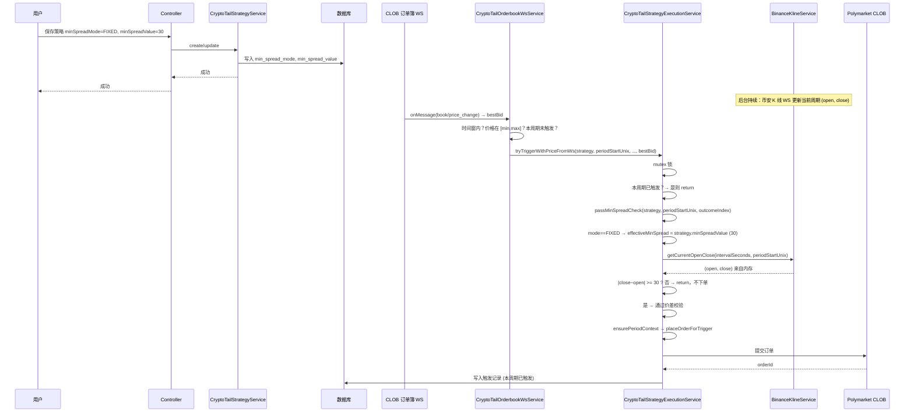
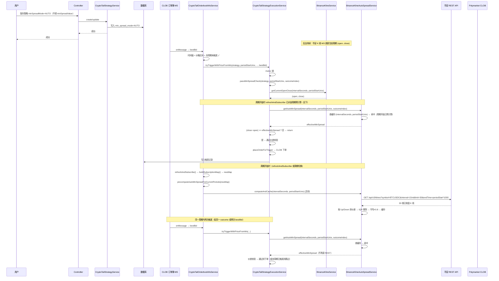

# 尾盘策略 - 最小价差参数流程分析

## 一、需求摘要

在现有尾盘策略上增加**最小价差**参数：当策略条件（时间窗、价格区间）满足时，再判断**当前周期 Binance K 线的开盘价与收盘价价差**是否满足最小价差；满足才下单，不满足则等待，直到价差满足再下单。

- **后端**：需订阅币安对应币对（如 BTC/USDC）的 K 线，维护当前周期的**开盘价**与**实时收盘价**，并在触发时做价差校验。
- **前端**：可配置三种场景——无、固定、自动（见下）。

---

## 二、前端配置场景

| 场景 | 配置方式 | 校验逻辑 |
|------|----------|----------|
| **无** | 不进行价差校验 | 与现有一致：仅判断时间窗 + 价格区间，满足即下单。 |
| **固定** | 用户输入一个固定价差（如 30） | 当 \|收盘价 − 开盘价\| ≥ 该固定值时，校验通过，再下单。 |
| **自动** | 由系统根据历史数据计算最小价差 | 见下文「自动模式计算逻辑」；得到数值后，后续与固定模式一致：\|收盘价 − 开盘价\| ≥ 计算值 则通过。 |

### 自动模式计算逻辑

- 通过币安 API 获取**历史 30 根** K 线（与策略周期一致：5m 取 5m K 线，15m 取 15m K 线）。
- **下单方向 = Down**（outcomeIndex = 1）：只取「收盘价 < 开盘价」的 K 线，得到价差序列（开盘价 − 收盘价）。
- **下单方向 = Up**（outcomeIndex = 0）：只取「收盘价 > 开盘价」的 K 线，得到价差序列（收盘价 − 开盘价）。
- **异常值剔除**：对上述价差序列做异常值过滤（见下文「异常值剔除」），再用**剩余样本**求平均价差，乘以系数 **80%** 得到最小价差；后续用该值做 \|收盘价 − 开盘价\| ≥ 该值 的校验。
- **历史数据获取时机**：**在该周期开始时就拉取并计算**，不在保存策略时计算。订单簿 WS 在周期开始时刷新订阅（含每 25 秒或周期切换时的 refreshAndSubscribe），此时对当前周期内所有启用且为 AUTO 的策略，按 (intervalSeconds, periodStartUnix) 预拉该周期前 30 根已收盘 K 线并计算 minSpreadUp/minSpreadDown 写入缓存；该周期内触发时直接用缓存，无需在触发时再调 REST。

### 异常值剔除

- **目的**：避免少数极端 K 线（如 14 组价差在 50 以内、1 组价差 200）拉高平均价差，导致最小价差偏大、难以触发。
- **做法**：在按方向得到价差序列后，先**剔除异常值**，再对剩余价差求平均并 × 0.8。
- **推荐方法：IQR（四分位距）**
  - 对价差序列排序，计算 Q1（25% 分位）、Q3（75% 分位）、IQR = Q3 − Q1。
  - 保留区间 **[Q1 − 1.5×IQR, Q3 + 1.5×IQR]** 内的价差，剔除该区间外的点。
  - 示例：15 组价差，14 组在 50 以内、1 组为 200 → 200 会超出上界被剔除，只用 14 组参与平均。
- **边界与降级**
  - 若剔除后剩余样本数过少（如 &lt; 3），则**不剔除**：用全部价差样本求平均 × 0.8。
  - 若无满足方向的 K 线（如 30 根里没有 close &lt; open），仍按原文档降级处理（全量 \|close−open\| 或返回 0）。

---

## 三、整体流程（含价差校验）

```
┌─────────────────────────────────────────────────────────────────────────────────┐
│ 1. 数据源与订阅                                                                  │
├─────────────────────────────────────────────────────────────────────────────────┤
│ • CLOB 订单簿 WS（现有）：Polymarket 订单簿 → bestBid。                          │
│ • 币安 K 线 WS（新增）：订阅 BTCUSDC 对应周期（5m/15m），维护「当前周期」的开盘价   │
│   open、实时收盘价 close（每根 K 线未收盘前 close 会持续更新）。                   │
└─────────────────────────────────────────────────────────────────────────────────┘
                                        │
                                        ▼
┌─────────────────────────────────────────────────────────────────────────────────┐
│ 2. 触发入口（与现有一致）                                                         │
├─────────────────────────────────────────────────────────────────────────────────┤
│ • 入口 A：CryptoTailOrderbookWsService.onBestBid(tokenId, bestBid)               │
│ • 入口 B：CryptoTailStrategyExecutionService.runCycle()（HTTP 拉订单簿）         │
│ 两者在「时间窗 + 价格区间 + 本周期未触发」通过后，都会调用执行层「尝试下单」。        │
└─────────────────────────────────────────────────────────────────────────────────┘
                                        │
                                        ▼
┌─────────────────────────────────────────────────────────────────────────────────┐
│ 3. 执行层增加「价差校验」                                                          │
├─────────────────────────────────────────────────────────────────────────────────┤
│ 在现有 tryTriggerWithPriceFromWs / runCycle → placeOrderForTrigger 之前增加：     │
│                                                                                  │
│   if (策略.minSpreadMode == NONE) → 直接进入 placeOrderForTrigger。              │
│   else:                                                                          │
│     • 从「币安 K 线服务」取当前周期（与 strategy.intervalSeconds 对齐）的 open、   │
│       close（实时）。                                                             │
│     • 若取不到 open/close（例如该周期尚未有数据）→ 本轮不下单，等待下次 WS 更新。   │
│     • 计算 effectiveMinSpread：                                                  │
│         - FIXED：effectiveMinSpread = 策略.minSpreadValue（用户填的固定值）        │
│         - AUTO：effectiveMinSpread = 按当前下单方向（outcomeIndex）取「自动计算    │
│           的最小价差」（见下节；若尚未计算则先拉 30 根历史 K 线并计算、缓存）。     │
│     • 若 |close − open| < effectiveMinSpread → 本轮不下单，等待价差满足。         │
│     • 若 |close − open| >= effectiveMinSpread → 通过价差校验，进入               │
│       placeOrderForTrigger（与现有逻辑一致：预签/签名、提交 CLOB 订单、写触发记录）。│
└─────────────────────────────────────────────────────────────────────────────────┘
```

- **「等待价差满足」**：不主动轮询；下次 CLOB 订单簿或币安 K 线有推送时，会再次进入上述判断，此时 close 可能已更新，价差可能已满足，再决定是否下单。
- **每周期最多触发一次**：仍由现有「本周期是否已触发」保证；价差不满足时**不写触发记录**，也不占「已触发」名额，直到某次检查同时满足价格区间与价差后才下单并标记已触发。

---

## 四、自动模式：何时拉历史、如何算、如何用

- **何时拉 30 根历史 K 线并计算**  
  - **在该周期开始时就预计算**，不在保存策略时计算。  
  - 订单簿 WS 在**周期开始时**会刷新订阅（`refreshAndSubscribe`：每 25 秒或检测到周期切换时），此时对当前周期内所有启用且 minSpreadMode=AUTO 的策略，按 `(intervalSeconds, periodStartUnix)` 异步拉取该周期前 30 根已收盘 K 线（REST `endTime = periodStartUnix * 1000`），按 Up/Down 分别算 avgSpread × 0.8（含 IQR 剔除）并写入缓存。该周期内后续触发时直接用缓存，**不在触发时再调 REST**。  
  - 若某周期未做预计算（如服务刚启动且尚未到刷新时机），触发时仍会按需调用 `computeAndCache` 并缓存，保证逻辑正确。  
  - 前端「自动最小价差」接口仅作**预览**，实际下单校验不依赖该接口。

- **计算细节**  
  - 历史 30 根：币安 REST `GET /api/v3/klines?symbol=BTCUSDC&interval=5m|15m&limit=30`（或 31 取前 30 根已收盘），每根格式为 [openTime, open, high, low, close, ...]。  
  - **Down（outcomeIndex=1）**：筛选 close < open，价差 = open − close，得到价差序列 → **异常值剔除（IQR）** → 对剩余价差求平均，再 × 0.8 → minSpreadDown。  
  - **Up（outcomeIndex=0）**：筛选 close > open，价差 = close − open，得到价差序列 → **异常值剔除（IQR）** → 对剩余价差求平均，再 × 0.8 → minSpreadUp。  
  - **异常值剔除**：见上文「异常值剔除」；剔除后再平均。若剔除后剩余样本 &lt; 3，则不剔除，用全部价差样本求平均。  
  - 若无满足方向的 K 线（例如 30 根里没有一根 close < open），可降级：用全部 30 根的 |close−open| 平均 × 0.8，或返回 0/不校验，具体产品可定。

- **触发时使用**  
  - 当前要下单的是 outcomeIndex（0=Up, 1=Down），取对应的 minSpreadUp 或 minSpreadDown 作为 effectiveMinSpread，再与 |close − open| 比较。

---

## 五、后端模块与数据流

| 模块 | 职责 |
|------|------|
| **BinanceKlineService（新）** | 1）订阅币安 WS：BTCUSDC 的 5m、15m K 线流（可按需只订阅有策略使用的周期）。<br>2）维护「当前周期」数据：以 periodStartUnix（或 K 线 t 对齐）为 key，存 (open, close)；K 线 WS 推送时更新 close，新周期首条推送时更新 open。<br>3）提供 getCurrentOpenClose(symbol, intervalSeconds, periodStartUnix) → (open, close)?，供执行层价差校验使用。 |
| **BinanceKlineAutoSpreadService 或合入上者（新）** | 1）按**周期**拉取：以 periodStartUnix 为界，REST 拉取该周期前的 30 根已收盘 K 线。<br>2）按 Up/Down 得到价差序列 → **IQR 异常值剔除** → 对剩余价差求平均 × 0.8，缓存 (intervalSeconds, periodStartUnix) → (minSpreadUp, minSpreadDown)。<br>3）提供 getAutoMinSpread(intervalSeconds, periodStartUnix, outcomeIndex) 与 computeAndCache(intervalSeconds, periodStartUnix)。**周期开始时**由 CryptoTailOrderbookWsService 在 refreshAndSubscribe 后对当前周期内 AUTO 策略预调 computeAndCache；触发时直接用缓存，未命中时再按需计算。 |
| **CryptoTailStrategy（实体）** | 新增字段建议：minSpreadMode（NONE/FIXED/AUTO）、minSpreadValue（固定时使用；AUTO 时可为空或存上次计算值用于展示）。 |
| **CryptoTailStrategyExecutionService（现有）** | 在 tryTriggerWithPriceFromWs 与 runCycle 分支中，在调用 placeOrderForTrigger 前：若 minSpreadMode != NONE，则取 open/close 与 effectiveMinSpread，校验 \|close−open\| >= effectiveMinSpread；不通过则 return，不调用 placeOrderForTrigger。 |
| **CryptoTailOrderbookWsService（现有）** | 仍只根据 CLOB bestBid 触发；价差校验在执行层统一做。**新增**：refreshAndSubscribe 完成后，对当前周期内所有启用且 minSpreadMode=AUTO 的策略，异步调用 BinanceKlineAutoSpreadService.computeAndCache，在周期开始即预计算最小价差。 |

- **币安 K 线与周期对齐**  
  - 策略周期：periodStartUnix 为秒（如 5m 周期 = 300 的倍数，15m = 900 的倍数）。  
  - 币安 K 线：t 为毫秒，同一周期：t_ms = periodStartUnix * 1000。  
  - 用 (intervalSeconds, periodStartUnix) 或 (interval, t_ms) 对齐即可从 BinanceKlineService 取到「当前周期」的 open 和实时 close。

---

## 六、固定（FIXED）与自动（AUTO）时序图

### 6.1 固定（FIXED）时序图

固定模式：用户保存策略时写入 `minSpreadValue`（如 30）；触发时直接用该值与当前周期 \|close−open\| 比较，不拉历史 K 线。



---

### 6.2 自动（AUTO）时序图

自动模式：不在保存策略时计算。**在该周期开始时就预计算**（订单簿 WS 刷新订阅时对该周期内 AUTO 策略异步拉 30 根历史 K 线并计算、缓存）；触发时直接用缓存，同一周期内复用。



---

## 七、流程小结（按执行顺序）

1. **策略配置**  
   - 用户选择：无 / 固定（输入数值）/ 自动。  
   - 固定：必填 minSpreadValue，保存到 DB。  
   - 自动：不填 minSpreadValue，**不在保存时计算**；按周期在首次需要时计算并缓存。

2. **运行时**  
   - 币安 WS 持续更新当前周期的 (open, close)。  
   - CLOB 订单簿（或 HTTP）带来 bestBid；若时间窗 + 价格区间 + 本周期未触发 均满足：  
     - 若 minSpreadMode == NONE → 直接 placeOrderForTrigger。  
     - 否则取当前周期 open/close 与 effectiveMinSpread（固定值或自动缓存值），若 \|close−open\| >= effectiveMinSpread → placeOrderForTrigger；否则本轮不下单，等后续推送再判。

3. **下单与去重**  
   - 仍保持「每周期最多触发一次」；价差不满足时不写触发记录，直到某次同时满足价格与价差后才下单并写记录。

按上述流程即可在现有尾盘策略上接入「最小价差」参数，并由后端订阅币安 K 线、在触发前做价差校验；固定与自动的时序差异见**第六节时序图**。
